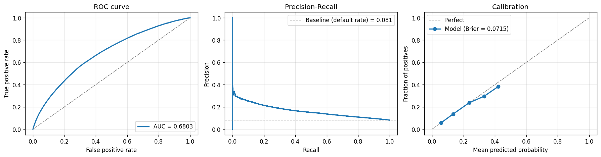
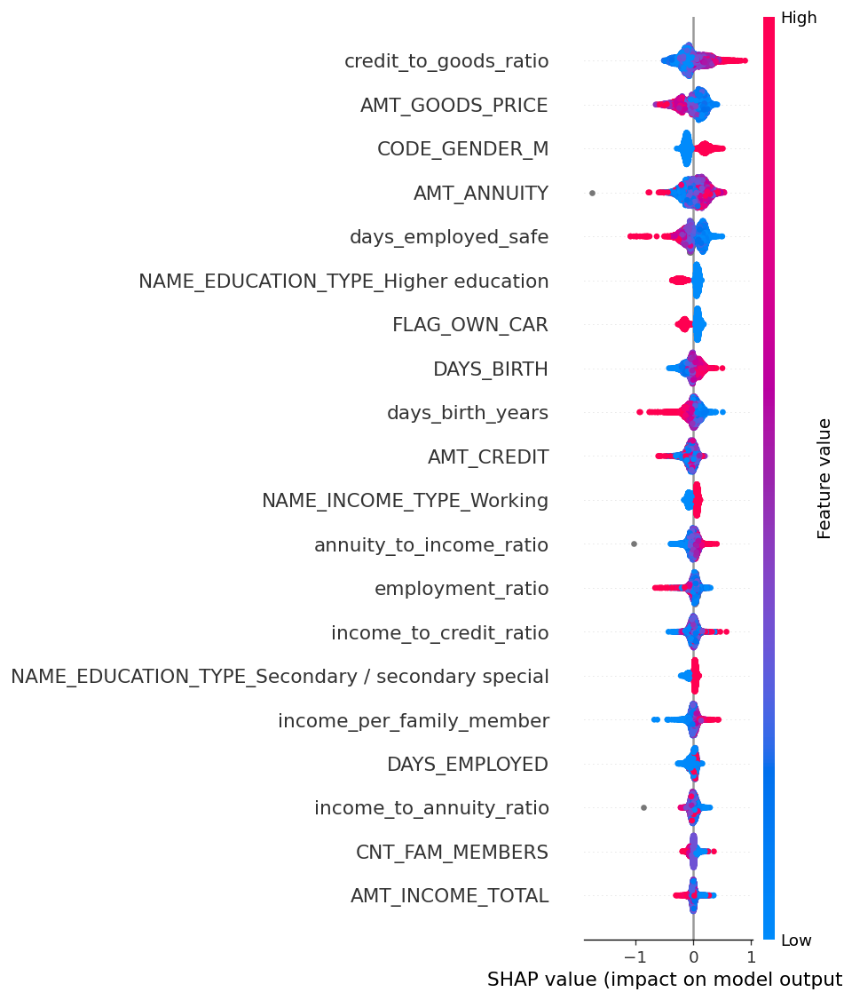
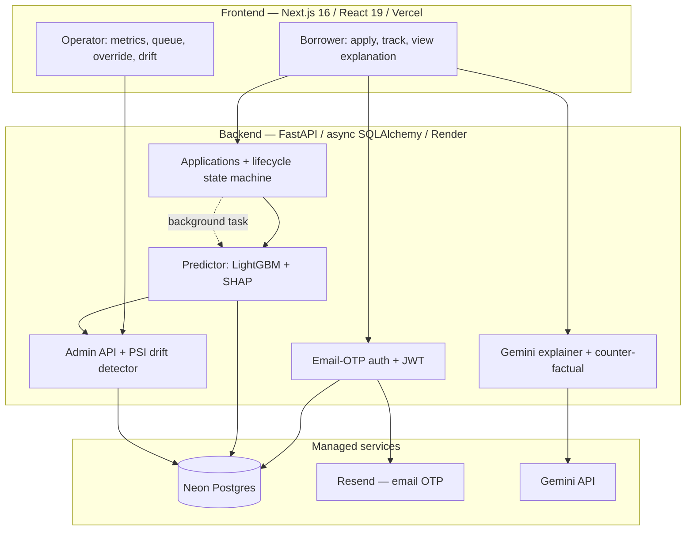

# KisanCredit — Credit Scoring for Thin-File Borrowers

An end-to-end machine-learning credit system: a LightGBM default-risk model
trained on 307,511 real loan applicants, served through a FastAPI backend with
a live application lifecycle, a lender-side operations dashboard with input-drift
monitoring, and Gemini-generated plain-language decision explanations.

**Status:** backend, ML, and frontend complete; deployment in progress
(Render API + Vercel frontend + Neon Postgres).

---

## The problem

A large share of people — in India and across emerging markets — are
*credit-invisible*. No credit card, no prior formal loan, so a traditional
underwriter has nothing to score and rejects them by default. The catch is
circular: you need a credit history to get credit, and credit to build a history.

These applicants are not all high-risk. Many have steady income, manageable
obligations, and stable employment — signal a model can use. KisanCredit scores
exactly that population and returns three things: a default-risk decision, the
factors behind it, and, when the answer isn't yes, a concrete suggestion for what
would change it.

---

## The model

The production model is trained on the
[Home Credit Default Risk](https://www.kaggle.com/c/home-credit-default-risk)
dataset — 307,511 anonymised applicants from a lender whose stated mandate is
serving customers with little or no credit-bureau history. No comparable
individual-level Indian dataset is publicly available (see
[Limitations](#limitations)), and Home Credit is the closest authentic,
large, publicly benchmarked stand-in for the target population.

### One decision worth explaining

Home Credit's most predictive features are its three `EXT_SOURCE` columns —
normalised scores from external credit bureaus. Train with them and the AUC is
roughly eight points higher.

This model is trained **without them**, on purpose. The entire premise is
scoring people who have no bureau record. A model that leans on a bureau score
to make its call doesn't work for the person it is meant to serve — it just
rebuilds the wall it was supposed to get around. So the feature set is
restricted to 39 features an applicant can actually supply at application time:
income, requested loan, employment length, age, household size, education,
housing, asset ownership, and ratios derived from those.

That decision costs accuracy. It is the honest tradeoff for a model that
matches the product.

| | |
|---|---|
| Algorithm | LightGBM, 39 application-time features |
| Validation | Stratified 5-fold cross-validation |
| Applicants | 307,511 |
| **ROC-AUC** | **0.6803 ± 0.0047** |
| Logistic-regression baseline | 0.6578 |
| Brier score (calibration) | 0.0715 |
| Default rate (class balance) | 8.07% |

For reference, the public Kaggle leaderboard tops out near 0.805 — but that
uses the full multi-table dataset (bureau records, prior applications, payment
histories), not the application-only feature set used here.

Sanity check on real applicants: the model predicts an average 24% default
probability for people who actually defaulted versus 5% for people who repaid —
a clean separation in the right direction (`python scripts/demo_v2_prediction.py`).





Reproduce it with `python scripts/train_home_credit.py` (the dataset downloads
via `kagglehub`).

### Decision thresholds

A calibrated default model on an 8%-default population outputs a narrow band of
probabilities, so a fixed cutoff like "approve above 0.6" would approve everyone.
The three decision bands — approve, manual review, reject — are instead derived
from percentiles of the model's own score distribution on the training set and
stored inside the model artifact. That makes the policy explicit and auditable:
approve the lowest-risk ~45%, send the riskiest ~18% to reject, review the rest.

### Why LightGBM, and what it was measured against

Gradient-boosted trees are the standard choice for tabular credit data, but
"standard" is not a reason on its own. `scripts/benchmark_tabnet.py` trains a
TabNet classifier — an attention-based deep-learning architecture for tabular
data, built on PyTorch — on the identical features and identical CV folds, so
the comparison is fair.

| Model | CV ROC-AUC |
|---|---|
| LightGBM | **0.6803** |
| Logistic regression | 0.6578 |
| TabNet (PyTorch) | 0.6524 |

LightGBM wins, and TabNet doesn't even clear the logistic-regression baseline —
the usual story for deep learning on tabular data at this scale without heavy
tuning. The model choice is now backed by a measured gap rather than a convention.

---

## What's in the system

It is a two-sided product, and that is deliberate. A model behind a form is a
demo; a model with an operations layer around it is a system. The second side is
where most of the interesting engineering lives.

### Borrower side

- Passwordless email-OTP sign-in.
- A multi-step application form. The fields map server-side onto the model's
  feature schema — the frontend never does feature engineering itself.
- A realistic application lifecycle: `submitted → under_review → decided`. Each
  transition is written as an immutable audit event and shown as a live timeline
  the page polls until the decision lands.
- Per-decision SHAP attributions — which features moved the score, and which way.
- A plain-language explanation generated by Gemini, in English or Hindi.
- A counter-factual "how to improve" card: a greedy search over the fields an
  applicant can realistically change, finding the smallest adjustment that would
  move the decision toward approval.

### Lender / operator side (`/admin`)

- A live metrics dashboard: throughput, approval rate, p95 latency, and a
  score-distribution histogram.
- The application queue — filterable by status, paginated, each row drilling
  into the full applicant record, features, SHAP breakdown, and timeline.
- Manual override: an operator can overturn a model decision, and the action is
  recorded with the actor and a reason in the audit trail.
- Input-drift monitoring: Population Stability Index per feature against the
  training-set baseline, banded into stable / moderate / significant.

---

## Architecture



The lifecycle runs as a FastAPI background task. The submit request returns
immediately with `status=submitted`; a worker then advances the application
through `under_review` and `decided`, running inference at the final step. The
frontend polls a timeline endpoint until the status is terminal.

---

## Tech stack

| Layer | Choice |
|---|---|
| Model | LightGBM, with a TabNet (PyTorch) baseline for comparison |
| Cross-validation, metrics, baseline | scikit-learn |
| Explainability | SHAP TreeExplainer |
| Natural-language explanations | Gemini 1.5 Flash (English / Hindi) |
| Drift | Population Stability Index (pure NumPy) |
| Backend | FastAPI, async SQLAlchemy 2.0, asyncpg, Alembic |
| Auth | JWT access + refresh tokens, email OTP via Resend |
| Database | PostgreSQL (Neon) |
| Frontend | Next.js 16 App Router, React 19, TypeScript, Tailwind, Recharts |
| Hosting | Render (API), Vercel (frontend) |

---

## Running it locally

```bash
# Backend
pip install -r requirements.txt
cp .env.example .env          # set DATABASE_URL (Neon); the other keys are optional
alembic upgrade head
python -m uvicorn src.api.main:app --reload    # http://localhost:8000 — /docs for Swagger

# Frontend
cd frontend && npm install
npm run dev                                     # http://localhost:3000
```

The optional integrations degrade gracefully when their keys are missing:

- no `GEMINI_API_KEY` — explanations fall back to a deterministic template
- no `RESEND_API_KEY` — the OTP is written to the API log instead of emailed
- no `REDIS_URL` — in-process caches are used instead

Retraining the model needs the dev dependencies:

```bash
pip install -r requirements-dev.txt
python scripts/train_home_credit.py     # downloads Home Credit, trains, writes models/home_credit_v2.pkl
python scripts/benchmark_tabnet.py      # the TabNet vs LightGBM comparison
```

---

## Project layout

```
src/
  api/         main.py · auth.py · users.py · admin.py · schemas.py · middleware.py
  auth/        jwt_handler · otp_manager (email OTP) · dependencies (require_admin)
  models/      predictor · explainer (SHAP) · drift_detector (PSI) · counterfactual
  features/    home_credit_features — form → model feature mapping
  llm/         gemini_explainer — NL explanations + counter-factual narration
  database/    models (7 tables) · repositories · connection
  cache/       recent_features (drift buffer) · redis_cache
frontend/
  app/         landing · login · apply · dashboard · admin/*
  components/  ui kit · AdminGuard · ErrorBoundary · Navbar
  lib/         api.ts · authApi.ts · authedFetch.ts · authStore.ts
scripts/       train_home_credit.py · benchmark_tabnet.py · demo_v2_prediction.py · promote_admin.py
notebooks/     home_credit_eval.png · home_credit_shap.png
alembic/       schema migrations
tests/         e2e · api · model tests
```

---

## Limitations

Worth being direct about what this is and isn't.

- **No Indian dataset.** Individual-level Indian credit data isn't publicly
  available — the DPDP Act 2023, RBI rules, and CIBIL's commercial position all
  keep it closed. Home Credit is a genuine emerging-market thin-file proxy, but a
  real Indian deployment would need CIBIL access or a partner-NBFC data agreement.
- **Modest accuracy, by design.** ROC-AUC 0.68 is well below the ~0.80 reachable
  with bureau features. That gap is the price of not using a bureau score — see
  [the design decision above](#one-decision-worth-explaining). It is a real, if
  imperfect, ranking of risk, not a finished underwriting model.
- **Fairness.** Predicted default rates differ across groups in the training
  data — 10.0% for men versus 7.0% for women, and 11.5% for under-30s versus 5.0%
  for over-60s. These track real base-rate differences in the dataset rather than
  a modelling bug, but a production system would need explicit fairness
  constraints and an adverse-action review process before it scored anyone.
- **Free-tier hosting.** Render sleeps the API after 15 minutes idle and takes
  roughly 50 seconds to wake; the frontend shows a warming-up state to cover it.

---

## Résumé summary

> **KisanCredit — ML credit-scoring system** · [code](https://github.com/Nilanshjain/KisanCredit)
>
> - Trained a LightGBM default-risk model on 307K real loan applicants
>   (ROC-AUC 0.68, 5-fold CV), deliberately excluding credit-bureau features so
>   the model works for thin-file applicants who have no bureau record, and
>   benchmarked it against a TabNet (PyTorch) deep-learning baseline on identical
>   folds.
> - Built the serving stack end to end: FastAPI and async SQLAlchemy, an
>   application-lifecycle state machine with a full audit trail, JWT and
>   email-OTP auth, SHAP explanations, and decision thresholds derived from the
>   model's own score distribution.
> - Added a lender-operations dashboard with Population Stability Index drift
>   monitoring against the training baseline and audit-trailed manual overrides,
>   plus Gemini-generated explanations and counter-factual guidance in English
>   and Hindi.

---

## Author

Nilansh Jain — [github.com/Nilanshjain](https://github.com/Nilanshjain)

MIT License.
