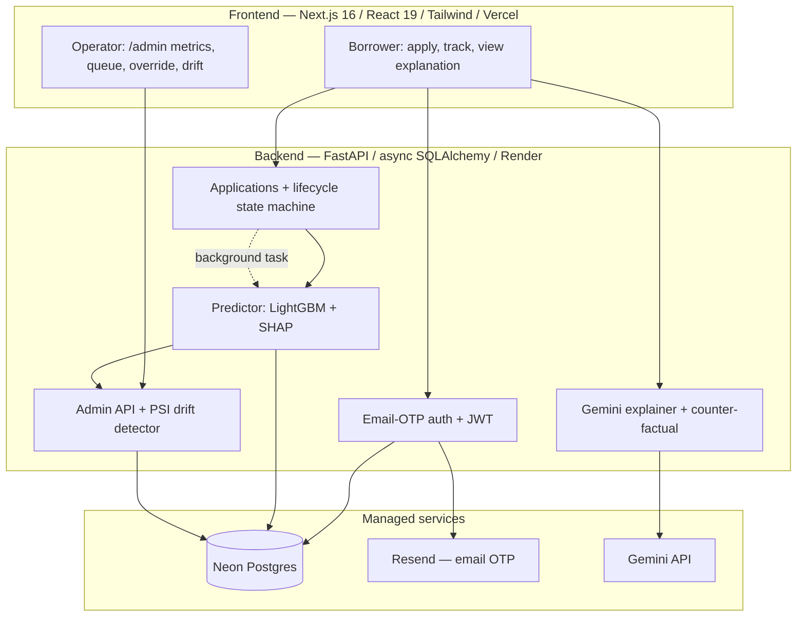

# KisanCredit — Alternative Credit Scoring for Thin-File Borrowers

> An end-to-end ML credit-scoring system: trained on **307,511 real loan applicants**,
> served through a FastAPI backend with a live application lifecycle, a lender/operator
> dashboard with input-drift monitoring, and Gemini-powered plain-language explanations.

**Status:** backend + ML + frontend complete · deployment in progress
(intended: Render API + Vercel frontend + Neon Postgres)

---

## The problem

Hundreds of millions of people — in India and across emerging markets — are
**credit-invisible**: no credit cards, no formal loan history, so traditional
underwriting rejects them by default. Yet they have real, scoreable financial
signal (income stability, payment discipline, existing obligations).

KisanCredit is a credit-scoring system for exactly that population: it produces
a default-risk score, an explainable decision, and an actionable "how to improve"
suggestion — for applicants a FICO-style model can't even evaluate.

---

## The ML model (v2)

The production model is trained on the **[Home Credit Default Risk](https://www.kaggle.com/c/home-credit-default-risk)**
dataset — 307,511 anonymised applicants from a lender whose explicit mandate is
serving clients *with insufficient credit history* across emerging markets. It's
the closest authentic, large, publicly-benchmarked approximation of the target
population (see [Honest limitations](#honest-limitations) for why no public
India-specific dataset exists).

| Metric | Value |
|---|---|
| Model | LightGBM, 149 engineered features |
| Validation | Stratified 5-fold CV |
| **ROC-AUC** | **0.7619 ± 0.0044** |
| Logistic-regression baseline | 0.7476 |
| Brier score (calibration) | 0.0676 |
| Public Kaggle SOTA (7,000 teams) | ~0.805 |
| Class balance (default rate) | 8.07% |

Reproduce it: `python scripts/train_home_credit.py` (dataset via `kagglehub`).
Smoke-test on real rows: `python scripts/demo_v2_prediction.py`.


**Why these numbers are honest:** AUC 0.76 against a 0.805 public benchmark is a
real, defensible result. The earlier prototype reported "R²=1.0 on synthetic
data" — a meaningless number from a toy generator. v2 replaces it with a model
trained and cross-validated on real applicants, calibrated, and fairness-checked.

---

## What's in the system

### Borrower side
- **Email-OTP passwordless auth** — no passwords, matching how real fintechs onboard thin-file users
- **Multi-step application form** → server-side feature engineering → LightGBM scoring
- **Realistic application lifecycle** — `submitted → under_review → decided`, each transition recorded as an immutable audit event, surfaced as a live polling timeline
- **SHAP explanations** — per-decision feature attributions
- **Gemini-narrated explanations** (English / हिन्दी) — plain-language "why" + one actionable suggestion
- **Counter-factual "how to improve"** — greedy search over actionable features finds the minimum change set that would flip the decision toward approval

### Lender / operator side (`/admin`)
- **Live metrics dashboard** — predictions/hour, approval rate, p95 latency, score-distribution histogram
- **Application queue** — status-filterable, paginated, with per-application drill-down
- **Manual override** — admin can override a model decision; recorded with actor + reason in the audit trail
- **Input-drift monitoring** — Population Stability Index (PSI) per feature vs the training-set baseline, with stable / moderate / significant bands

This two-sided design — borrower *and* operator — is what makes it a production ML
*system*, not just a model behind a form.

### Trying the live demo

The deployment runs with `DEMO_MODE=true`, so the OTP is shown on the login
screen — no inbox needed:

- **Borrower view** — sign in with *any* email, submit an application, watch the
  lifecycle and decision.
- **Operator view** — sign in with the demo operator email (in the deployed
  app's login hint / pinned repo description) to reach `/admin`. That account is
  auto-seeded with the admin role on every startup.

A real production deploy sets `DEMO_MODE=false`; the OTP then only goes by email
and admin promotion is a deliberate, separate step (`scripts/promote_admin.py`).

---

## Architecture



The application lifecycle runs as a FastAPI `BackgroundTask`: the submit request
returns immediately with `status=submitted`, then a worker walks it through
`under_review` and `decided` (running inference at the decision step). The
frontend polls a timeline endpoint until the status is terminal.

---

## Tech stack

| Layer | Choice | Notes |
|---|---|---|
| ML model | **LightGBM** | Correct tool for tabular credit risk; beats DL at this scale |
| Baseline / metrics | scikit-learn | Logistic-regression sanity baseline, stratified CV |
| Explainability | **SHAP** TreeExplainer | Per-decision attributions |
| LLM layer | **Gemini 1.5 Flash** | NL explanations + counter-factual narration, EN/HI |
| Drift | Population Stability Index | Pure-numpy, ~30 lines, industry-standard |
| Backend | **FastAPI** + async SQLAlchemy 2.0 | asyncpg, Alembic migrations |
| Auth | JWT (access + refresh) + email OTP | Passwordless, via Resend |
| Database | PostgreSQL (**Neon**) | Serverless, persistent free tier |
| Frontend | **Next.js 16** (App Router), React 19, TS 5.9 | Tailwind 4, Zustand, Recharts, Framer Motion |
| Deploy | Render (API) + Vercel (frontend) | both free tier |

---

## Run it locally

```bash
# Backend
pip install -r requirements.txt
cp .env.example .env          # fill DATABASE_URL (Neon); other keys optional
alembic upgrade head
python -m uvicorn src.api.main:app --reload      # http://localhost:8000  · /docs for Swagger

# Frontend
cd frontend && npm install
npm run dev                                       # http://localhost:3000
```

Optional integrations degrade gracefully when their keys are unset:
- **No `GEMINI_API_KEY`** → explanations fall back to a deterministic template
- **No `RESEND_API_KEY`** → the OTP is printed to the API logs instead of emailed
- **No `REDIS_URL`** → in-process caches are used

### Retrain the model

```bash
pip install -r requirements-dev.txt
python scripts/train_home_credit.py    # downloads Home Credit via kagglehub, trains, saves models/home_credit_v2.pkl
```

---

## Project layout

```
src/
  api/         main.py · auth.py · users.py · admin.py · schemas.py · middleware.py
  auth/        jwt_handler · otp_manager (email OTP) · dependencies (require_admin)
  models/      predictor · explainer (SHAP) · drift_detector (PSI) · counterfactual
  llm/         gemini_explainer — NL explanations + counter-factual narration
  features/    feature_engineering + 6 category extractors
  database/    models (7 tables) · repositories · connection
  cache/       recent_features (drift buffer) · redis_cache
frontend/
  app/         landing · login (email OTP) · apply · dashboard · admin/*
  components/  ui kit · AdminGuard · ErrorBoundary · Navbar
  lib/         api.ts · authApi.ts · authStore.ts
scripts/       train_home_credit.py · demo_v2_prediction.py · promote_admin.py
notebooks/     home_credit_eval.png · home_credit_shap.png
alembic/       migrations (6-table schema · password_hash · status_events · user_role)
tests/         e2e · api · model tests
```

---

## Honest limitations

- **No public India-specific dataset.** Individual-level Indian credit data isn't
  publicly available — DPDPA 2023, RBI guidelines, and CIBIL's commercial monopoly
  prevent it. Home Credit is the closest authentic public proxy (emerging-market,
  thin-file). Production deployment in India would require CIBIL access or a
  partner-NBFC data agreement.
- **Fairness.** The model shows differential predicted-default rates by gender
  (M 9.9% / F 7.0%) and age (under-30 11.5% / 60+ 4.8%). These reflect genuine
  base-rate differences in the dataset, not a model bug — but a production system
  would need explicit fairness constraints and adverse-action review.
- **The applicant form** collects a simplified field set and synthesises a richer
  payload server-side; the v2 model's full Home Credit feature schema isn't
  exposed end-to-end through the demo form yet.
- **Free-tier infra.** Render spins down after 15 min idle (~50s cold start);
  the frontend pre-warms the API on page load to mask it.

---

## Resume bullets

> **KisanCredit — ML credit-scoring system** · [code](https://github.com/Nilanshjain/KisanCredit)
>
> - Trained a LightGBM credit-default model on **307K real Home Credit applicants** (149 engineered features); **ROC-AUC 0.76** on stratified 5-fold CV vs. 0.805 public SOTA, calibrated (Brier 0.068), with SHAP attributions and a fairness audit across gender and age cohorts
> - Built the full production stack — **FastAPI + async SQLAlchemy + LightGBM serving**, an application-lifecycle state machine with audit trail, JWT + email-OTP auth — and a **lender dashboard with PSI-based input-drift monitoring** and audit-trailed manual overrides
> - Integrated **Gemini** for plain-language decision explanations (English/Hindi) and **greedy-search counter-factuals** ("how to improve"), with graceful template fallback when the LLM is unavailable

Three angles: **ML rigor · production engineering · operator-grade observability.**

---

## Author

**Nilansh Jain** — [github.com/Nilanshjain](https://github.com/Nilanshjain)

MIT License.
